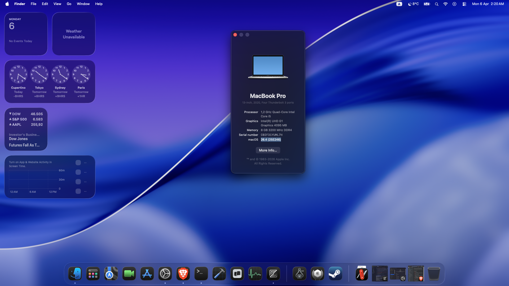
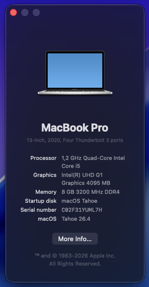

# OpenCore hackintosh EFI for Lenovo IdeaPad 5 15IIL05


*MacOS Tahoe 26.4*

This EFI supports running macOS Big Sur through Tahoe using the OpenCore bootloader. It is still in development, so expect bugs and various other issues to appear here and there. I only tested it on my 87K laptop, and it may not work properly on variants of this model with older or newer CPUs for example.
Thus I would greatly appreciate your contributions & bug reports in order to improve and optimize it.

*If you like my work, consider starring this repo and taking a look at my other projects ❤️*

## Specifications/Specs 


|Component|Details|
|---|---|
|**CPU**|**Intel(R) Core(TM) i5-1035G1 CPU @ 1.00GHz**|
|**RAM**|**8G DDR4 3200MHz**|
|**iGPU**|**Intel(R) UHD G1 Graphics 4095MB VRAM**|
|**SSD**|**UMIS RPJTJ512MEE1OWX 512GB NVMe PCIe**|
|**WIFI**|**Intel Wi‑Fi 6 AX201 160MHz + Bluetooth 5**|
|**Audio**|**Realtek ALC257**|
|**Ports**|**2xUSB3.0, 1xUSB3.0 Type-C, HDMI, SD card reader, Headphone Jack, and DC charging port**|
|**Fingerprint**|**ELAN fingerprint sensor**|
|**Webcam**|**Integrated 720p HD webcam**|
|**OpenCore**|**2.4.1**|

## Things not Working
+ HDMI does not work at all. this is a common problem on Ice Lake iGPUs that cannot be corrected.
+ the ELAN fingerprint sensor (cannot work on a hackintosh because of Apple security policies)
+ hibernation is buggy and should be disabled (can cause high CPU usage after wake because of BT driver problems)
 
## Things Working
+ the UHD G1 iGPU works perfectly with Metal 3 hardware acceleration support & the full 4GB of VRAM working
+ Sound works via AppleALC.kext with layout_id=11
+ trackpad & keyboard work throughout different Voodoo kexts.
+ all ports (except HDMI) works thanks to USBTMap.kext mapping.
+ Wi-fi works through Airport & HeliPort, and Bluetooth works correclty.
+ everything else works (Webcam, SSD...)

## How to Install
1. On Windows, Linux or macOS, take a USB key of at least 4GB and format it to fat32 (using command line utilities on linux, the explorer on windows, and Disk Utility on macOS. For more infos, take a look here : https://dortania.github.io/OpenCore-Install-Guide/installer-guide/ => Creating the USB) 
2. Copy-paste the EFI directory of this repository on the fomatted USB key, and create a 'com.apple.recovery' directory there.
3. Make sure you have python3 installed, then cd into this directory and run : 
```
python3 fetch-macOS-v2.py
```
Then, choose the version of macOS you want (from 1 to 9 => if you want stability, go with Ventura but if you want the latest software out there choose Tahoe)

4. When download is complete, copy-paste both BaseSystem.dmg & BaseSystem.chunklist to the newly created com.apple.recovery directory, and reboot your machine.
5. After that, quickly press your BIOS key (F2, ESC or DEL) and choose your USB key.
6. Finally, in the Open Core menu, use the arrows to choose an option called 'NO NAME', 'RECOVERY' or 'INSTALLED' (the correct macOS recovery option) but do not choose Windows or another macOS installation.
7. Here you go ! you are now in an apple recovery environment. you can now follow the standard procedure to install macOS on your drive.

## Important Notes
+ if you are using a recent version of macOS Sonoma or macOS Sequoia/Tahoe, you must install the Heliport app to get wifi working.
+ if you are using Tahoe, you must either reinject the AppleHDA.kext driver (https://github.com/Mirone/MyKextInstaller and follow the steps) or install the VoodooHDA driver.
+ I never understood why this happens or how to fix it, but the screen sometimes flickers in grey or dark windows. if anyone has a fix for this, let me know.

## Credits
+ the dortania guide (https://dortania.github.io/OpenCore-Install-Guide/) which I massively used to improve & fix my EFI.
+ this hackintosh EFI here which inspired me (https://github.com/Trijal08/OpenCore-Hackintosh-Lenovo-IdeaPad-3-15IIL05)
+ the OpCore-Simplify scripts which helped me in many ways across the creation of this EFI.
+ the OSX-KVM repo which contains the fetch-macOS-v2.py script (https://github.com/kholia/OSX-KVM)
